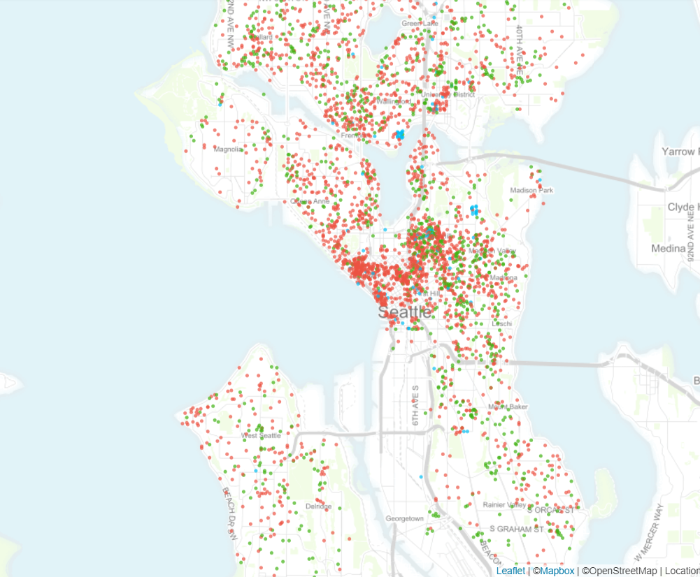

## Airbnb Data Understanding

### 1. Business Understanding
1.How many seasons are the peak season or the low season?  
2.Which type of house do visitors like to browse? Are they sensitive to price?  
3.What type of room do visitors like best?What’s the difference between the type of room a visitor is looking at? 
[At the have me about this problem analysis](https://medium.com/@yangwang_57085/use-seattle-airbnb-data-to-find-best-fit-sightseer-to-seattle-db2d29d66656)     

### 2. Data Understanding

Use pandas to explore data to data understanding.

### 3. Prepare Data
Use pandas to clearing data

### 4.Model Data
Use OLS and Random Forest to predict data.

### 5.Result
At Random Forest model use MSE to evaluate model,use R score evaluate model at train 0.849,at test 0.707 overfitting.

### 6.Deploy
Use joblib functon to save model at deploy.